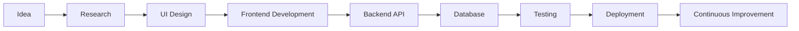

<div align="center">


# 👋 Hi, I'm **AL SAIDUL ARMAN MIR**

### 🚀 Full Stack MERN & Next.js Developer • TypeScript Enthusiast • UI Craftsman


<p>


</p>

</div>

---

# 💫 About Me


I'm a **Full Stack Web Developer** from **Bangladesh 🇧🇩** passionate about building scalable, secure, and modern web applications.

I enjoy transforming ideas into polished digital experiences using modern technologies while writing clean, maintainable code.

### 💡 What I Do

- 🚀 Build production-ready MERN & Next.js applications
- 🎨 Design beautiful, responsive user interfaces
- 🔐 Develop secure authentication systems
- ⚡ Build REST APIs and scalable backend services
- 📱 Create responsive websites for every device
- 🧩 Solve complex programming problems
- 🌱 Continuously learn modern web technologies

---

# ⚡ Quick Facts

```yaml
Name: AL SAIDUL ARMAN MIR

Location: Bangladesh 🇧🇩

Role: Full Stack MERN Developer

Experience:
  - MERN Stack
  - Next.js
  - TypeScript
  - REST APIs

Currently Learning:
  - Advanced Next.js
  - System Design
  - TypeScript Best Practices
  - Scalable Backend Architecture

Open To:
  - Remote Jobs
  - Freelance Projects
  - Open Source
  - Collaborations

Fun Fact:
  "I love turning coffee into code ☕"
```

---

# 🌐 Portfolio

<div align="center">

### 💻 Visit My Portfolio

<a href="https://al-saidul-arman-mir.netlify.app">

</a>

</div>

---

# 🚀 Tech Universe

<div align="center">

## Frontend


## Backend


## UI & Styling


## Development


</div>

---

# 🧠 Technology Dashboard

| Category | Technologies |
|------------|-------------|
| 🎨 Frontend | HTML5, CSS3, JavaScript, TypeScript, React.js, Next.js |
| ⚙ Backend | Node.js, Express.js |
| 🗄 Database | MongoDB |
| 🎭 UI Libraries | Tailwind CSS, shadcn/ui, Framer Motion |
| 🔥 Validation | Zod |
| 🔐 Authentication | Firebase Authentication |
| 📦 State Management | React Hooks, Context API |
| 🌍 APIs | REST API |
| 🚀 Deployment | Vercel, Netlify |
| 💻 Tools | Git, GitHub, VS Code, Postman |

---

# 📈 Skill Progress

<div align="center">

| Skill | Progress |
|-------|----------|
| React.js | 🟦🟦🟦🟦🟦⬜ |
| Next.js | 🟦🟦🟦🟦🟦⬜ |
| TypeScript | 🟦🟦🟦🟦⬜⬜ |
| Node.js | 🟦🟦🟦🟦🟦⬜ |
| Express.js | 🟦🟦🟦🟦🟦⬜ |
| MongoDB | 🟦🟦🟦🟦🟦⬜ |
| Tailwind CSS | 🟦🟦🟦🟦🟦🟦 |
| Git & GitHub | 🟦🟦🟦🟦🟦⬜ |

</div>

---

# 🛠 Development Environment

```javascript
const arman = {
    code: [
        "JavaScript",
        "TypeScript",
        "React",
        "Next.js",
        "Node.js",
        "Express",
        "MongoDB"
    ],

    frontend: [
        "React",
        "Next.js",
        "TailwindCSS",
        "shadcn/ui",
        "Framer Motion"
    ],

    backend: [
        "Node.js",
        "Express.js",
        "REST API"
    ],

    database: [
        "MongoDB"
    ],

    authentication: [
        "Firebase Auth"
    ],

    validation: [
        "Zod"
    ],

    deployment: [
        "Vercel",
        "Netlify"
    ],

    currentFocus: [
        "Scalable Applications",
        "Advanced Next.js",
        "System Design"
    ]
}
```

---

<div align="center">

## ⭐ "Building modern web experiences with clean architecture and beautiful UI."

</div>


# 🚀 Featured Projects

<div align="center">

### 💼 Projects I've Built

<table>
<tr>

<td width="50%">

## 🛠 KajWala

A complete service marketplace connecting customers with skilled professionals through a modern, secure and scalable platform.

### ✨ Features

- 🔐 Firebase Authentication
- 💳 Stripe Payment Integration
- 📦 Booking Management
- ⭐ Ratings & Reviews
- 👨‍💼 Admin Dashboard
- 📱 Fully Responsive

### ⚙ Tech Stack

`React` `Node.js` `Express` `MongoDB` `Firebase` `Stripe`

<a href="https://kajwala.netlify.app">

</a>

</td>

<td width="50%">

## 🎮 Urban Arcade

Modern gaming platform showcasing multiple browser games with clean UI and responsive design.

### ✨ Features

- 🎲 Multiple Games
- 🌙 Modern UI
- ⚡ Fast Performance
- 📱 Responsive Design
- 🎨 Beautiful Animations

### ⚙ Tech Stack

`React` `Tailwind CSS` `JavaScript`

<a href="https://urban-arcade-mir-dev.netlify.app/">

</a>

</td>

</tr>

<tr>

<td width="50%">

## 🚀 Appora.io

Landing page and SaaS website focused on performance, responsiveness and smooth user experience.

### ✨ Features

- ⚡ Lightning Fast
- 📱 Responsive
- 🎨 Modern Design
- 💎 Clean Components

### ⚙ Tech Stack

`React`

`Tailwind CSS`

`Framer Motion`

<a href="https://appora-io-as-mir.netlify.app/">

</a>

</td>

<td width="50%">

## 🏨 EZY Hotel

A SaaS platform allowing hotels to build and manage beautiful hotel websites with custom domains and online booking.

### ✨ Features

- 🏨 Multi Hotel Management
- 🌐 Custom Domains
- 💳 Subscription Plans
- 📊 Dashboard
- 📱 Responsive
- ⚡ SEO Friendly

### ⚙ Tech Stack

`Next.js`

`TypeScript`

`MongoDB`

`Tailwind CSS`

`Node.js`

</td>

</tr>

</table>

</div>

---

# 🧩 Development Workflow



---

# 🗂 Project Architecture

```text
Project

├── app/

├── components/

│   ├── ui/

│   ├── shared/

│   ├── layout/

│   └── features/

├── hooks/

├── lib/

├── services/

├── utils/

├── types/

├── middleware/

├── public/

├── server/

├── prisma/

├── database/

└── README.md
```

---

# 🚀 What I'm Currently Building

```yaml
Current Projects:

  ✔ MERN Applications

  ✔ Next.js Full Stack Apps

  ✔ SaaS Products

  ✔ Hotel Management Platform

  ✔ Scalable REST APIs

Learning:

  ✔ Advanced TypeScript

  ✔ Next.js Server Actions

  ✔ Authentication

  ✔ Performance Optimization

  ✔ System Design

Next Goals:

  ✔ Docker

  ✔ AWS

  ✔ PostgreSQL

  ✔ Prisma ORM

  ✔ CI/CD
```

---

# 🎯 2026 Goals

<div align="center">

| Goal | Status |
|-------|--------|
| Build 10 Production Projects | 🚀 In Progress |
| Master Next.js | 🔥 In Progress |
| Learn Docker | 📖 Learning |
| Learn AWS | 📖 Learning |
| Contribute to Open Source | 🚀 Active |
| Land Remote Full Stack Job | 🎯 Target |
| Build Successful SaaS Product | 💡 Working |

</div>

---

# 📚 Currently Exploring

<div align="center">


</div>

---

# ⚡ Development Principles

```javascript
const principles = {

    cleanCode: true,

    responsiveDesign: true,

    accessibility: true,

    scalability: true,

    maintainability: true,

    reusableComponents: true,

    securityFirst: true,

    performanceOptimization: true,

    mobileFirst: true,

    continuousLearning: true
}
```

---

# 💼 Services

### 🌐 Web Development

Modern websites and web applications built with the MERN Stack.

---

### ⚡ Full Stack Development

Complete frontend and backend solutions with scalable architecture.

---

### 🚀 Next.js Applications

SEO-friendly, high-performance applications using the latest Next.js features.

---

### 🎨 UI Development

Responsive, pixel-perfect interfaces with Tailwind CSS and modern design systems.

---

### 🔐 Authentication & APIs

Secure authentication, REST APIs and backend integrations.

---

# 🌟 Open Source Journey

```text
Started Coding
      │
      ▼
HTML • CSS • JavaScript
      │
      ▼
React Development
      │
      ▼
Node.js & Express
      │
      ▼
MongoDB
      │
      ▼
Full Stack MERN
      │
      ▼
Next.js + TypeScript
      │
      ▼
Building SaaS Products 🚀
```

---

<div align="center">

## 💡 "Every project is an opportunity to learn, improve and create something meaningful."

</div>


# 📊 GitHub Analytics

<div align="center">


</div>

---

# 🔥 GitHub Streak

<div align="center">


</div>

---

# 📈 Contribution Graph

<div align="center">


</div>

---

# 🏆 GitHub Trophies

<div align="center">


</div>

---

# 💻 My Development Setup

```yaml
Operating System:
  Windows 11

Editor:
  Visual Studio Code

Browser:
  Google Chrome

Version Control:
  Git
  GitHub

Database:
  MongoDB Atlas

Deployment:
  Vercel
  Netlify

API Testing:
  Postman

Design:
  Figma

Terminal:
  PowerShell

Package Managers:
  npm
```

---

# ⚙ My Workflow

```text
☕ Coffee
     │
     ▼
📝 Plan Features
     │
     ▼
🎨 Design UI
     │
     ▼
⚛ Frontend
     │
     ▼
⚙ Backend
     │
     ▼
🗄 Database
     │
     ▼
🧪 Testing
     │
     ▼
🚀 Deploy
     │
     ▼
🔄 Improve
```

---

# 📈 Developer Mindset

<div align="center">

| 💡 Principle | ✔ Focus |
|--------------|----------|
| Clean Code | ⭐⭐⭐⭐⭐ |
| UI/UX | ⭐⭐⭐⭐⭐ |
| Scalability | ⭐⭐⭐⭐☆ |
| Performance | ⭐⭐⭐⭐☆ |
| Security | ⭐⭐⭐⭐☆ |
| Accessibility | ⭐⭐⭐⭐☆ |
| Maintainability | ⭐⭐⭐⭐⭐ |
| Continuous Learning | ⭐⭐⭐⭐⭐ |

</div>

---

# 🌍 Connect With Me

<div align="center">

<a href="https://al-saidul-arman-mir.netlify.app">

</a>

<a href="https://github.com/ArmanMirDeV">

</a>

<a href="https://www.linkedin.com/in/a-s-arman-mir-7578a6213">

</a>

<a href="https://x.com/ASArmanMir45074">

</a>

<a href="https://www.instagram.com/arman_mir_8583/">

</a>

<a href="mailto:mirarman8583@gmail.com">

</a>

</div>

---

# 📫 Reach Me

```yaml
Name:
  AL SAIDUL ARMAN MIR

Country:
  Bangladesh 🇧🇩

Email:
  mirarman8583@gmail.com

Portfolio:
  https://al-saidul-arman-mir.netlify.app

Open To:
  ✔ Full-Time
  ✔ Remote
  ✔ Freelance
  ✔ Collaboration
```

---

# 📊 Profile Summary

```text
👨‍💻 Full Stack MERN Developer

⚛ Next.js Enthusiast

🎨 UI Craftsman

🚀 SaaS Builder

🧠 Lifelong Learner

🌍 Open Source Supporter

☕ Coffee Driven Developer
```

---

# 💬 Favorite Quote

<div align="center">

> **"First, solve the problem. Then, write the code."**

### — John Johnson

</div>

---

# 💡 Dev Philosophy

```javascript
while(alive){

    Learn();

    Build();

    Break();

    Fix();

    Improve();

    Repeat();

}
```

---

# 🚀 Looking For

- 🌍 Remote Opportunities

- 💼 Full Stack Developer Roles

- 🤝 Open Source Collaborations

- 🚀 Startup Projects

- 💡 SaaS Development

- 🎯 Exciting Challenges

---

# ⭐ Thanks For Visiting

<div align="center">

### If you like my work, consider giving my repositories a ⭐


</div>

---

<div align="center">

### ⭐ From [ArmanMirDeV](https://github.com/ArmanMirDeV)

**Made with ❤️, lots of ☕, and countless hours of coding.**

</div>
